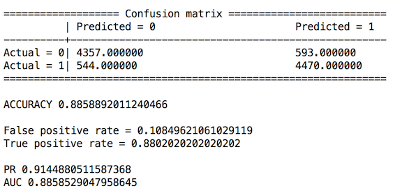

TF-IDF with Spark for https://www.kaggle.com/c/word2vec-nlp-tutorial 

Results are not as good as using sklean (Python)

Credits:

- https://github.com/brokendata/Spark20NewsGroup
- https://github.com/dpapeatgithub/spark-logistic-regression-spam-sms
